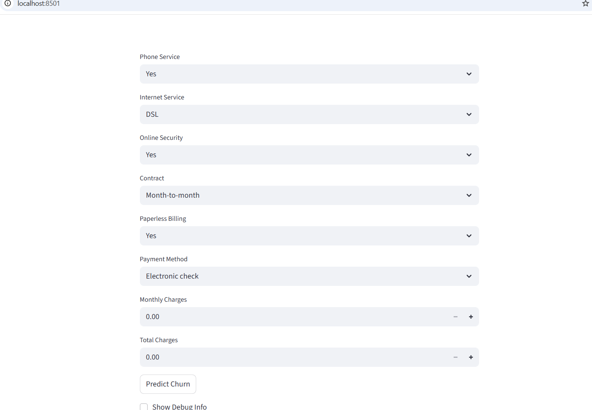

---

##  Dataset

The dataset used is **Telco Customer Churn** from Kaggle, which contains customer demographic information, account details, and service usage.  

**Target column:** `Churn`  
- `Yes` → 1 (Customer will churn)  
- `No` → 0 (Customer will not churn)

---

##  Tools and Libraries

- Python 3.10  
- Pandas, NumPy  
- Scikit-learn, XGBoost  
- Matplotlib, Seaborn  
- Joblib  
- Streamlit  

---

##  Features

The model considers features such as:  

- Customer demographics: `gender`, `SeniorCitizen`, `Partner`, `Dependents`  
- Account info: `tenure`, `Contract`, `PaperlessBilling`, `PaymentMethod`  
- Services: `PhoneService`, `InternetService`, `OnlineSecurity`  
- Charges: `MonthlyCharges`, `TotalCharges`  

---git pull origin main --rebase


##  App Screenshot





##  How to Run

1. **Clone the repository**  
```bash
git clone https://github.com/Sanjai229/Customer-Churn-Prediction.git
cd customer-churn-prediction
